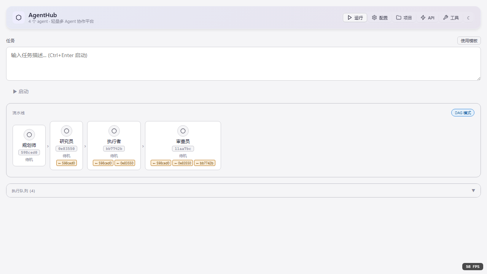
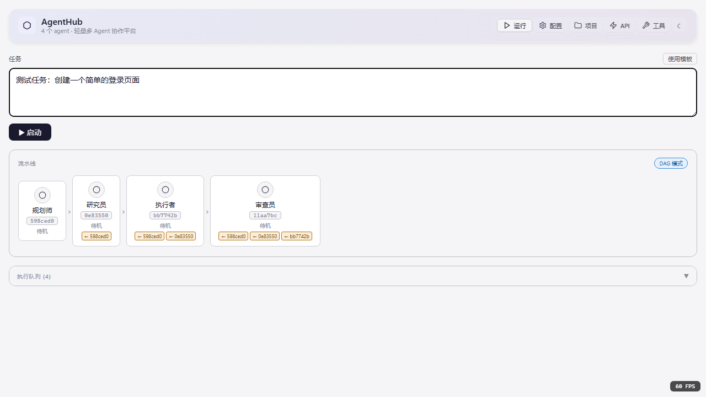
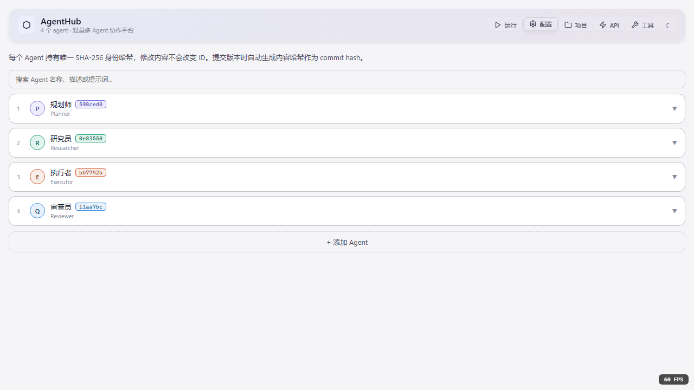
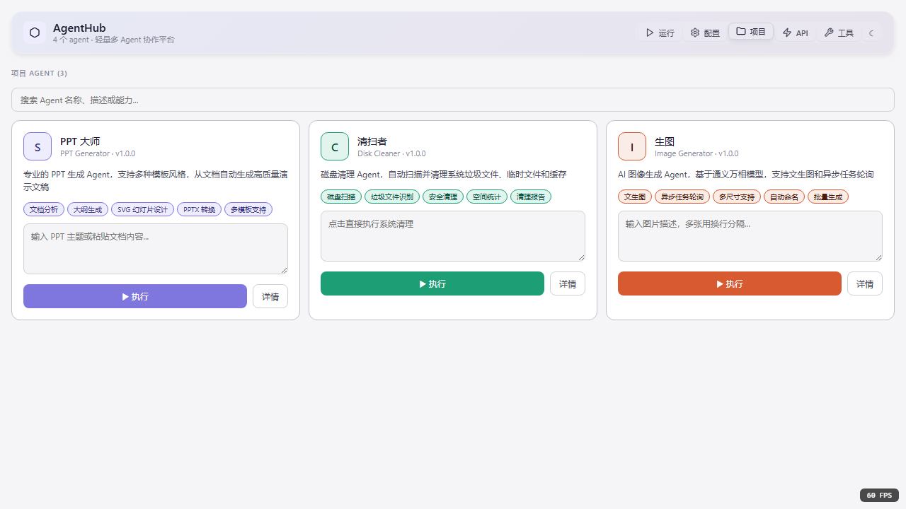
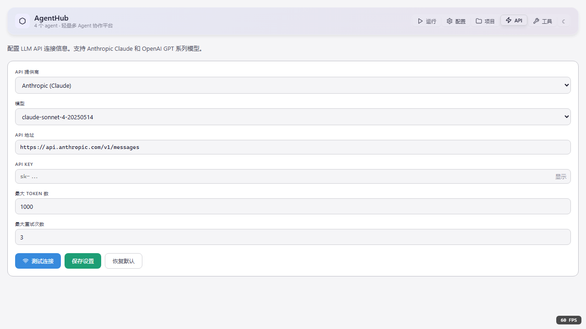
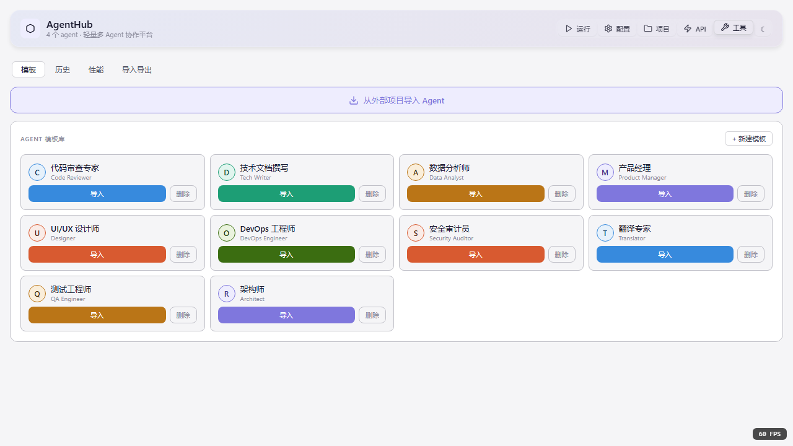
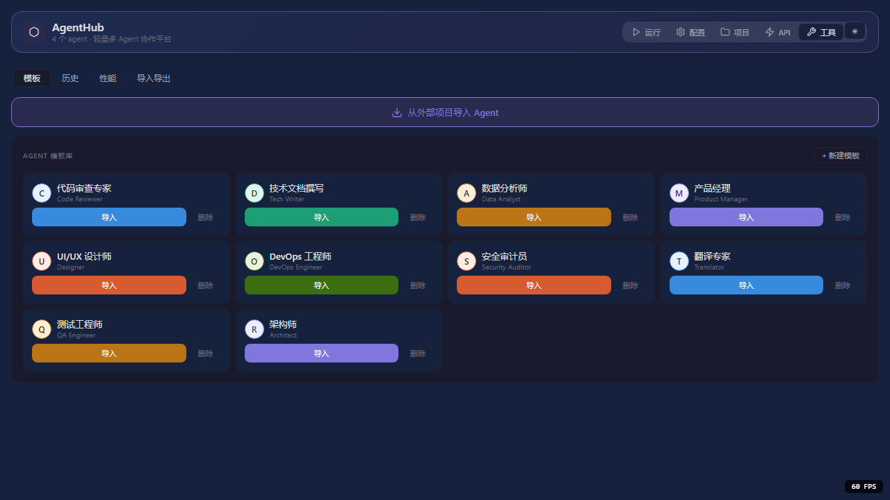

# AgentHub

<div align="center">

**轻量多 Agent 协作平台 — 动态 Workflow Runtime**

[](LICENSE)
[](tests)
[](package.json)

</div>

---

## 项目简介

AgentHub 是一个**动态、可验证、可审计的 Workflow Runtime**，用于编排多个 AI Agent 协作完成复杂任务。

核心架构：

```
用户输入 → Goal Compiler → Goal Contract → Orchestrator → Workflow IR 
    → Harness Runtime → Subagents → Step Reports → Verifiers → 完成/重规划
```

## 界面预览

### 主界面



主界面展示：
- **顶部导航栏**：运行、配置、项目、API、工具五个 Tab
- **Agent 卡片**：显示 4 个内置 Agent（规划师、研究员、执行者、审查员）及其状态
- **任务输入框**：支持 Ctrl+Enter 快速启动
- **执行队列**：实时显示任务执行进度

### 任务输入



支持自然语言输入任务描述，系统自动编译为 Goal Contract。

### 配置管理



配置页面功能：
- Agent 名称、颜色、系统提示词编辑
- LLM Provider 配置（Anthropic / OpenAI / DeepSeek）
- 依赖关系 DAG 配置
- Git 式版本控制（提交、回滚、差异对比）

### 项目管理



项目页面展示内置 Agent 项目：
- **PPT 大师**：专业 PPT 生成 Agent
- **清扫者**：磁盘清理 Agent
- **生图**：AI 图片生成 Agent

### API 配置



支持多 LLM Provider 配置：
- Anthropic Claude
- OpenAI GPT
- DeepSeek
- 13+ Provider 支持，4 种路由策略

### 工具与追踪



工具页面包含：
- **Tracing UI**：执行链路可视化
- **任务看板**：任务分发与认领
- **执行历史**：历史记录查看
- **导入导出**：配置备份与恢复

### 暗色主题



支持亮色/暗色主题切换，适配不同使用场景。

---

## 核心特性

### v1.7.0 — 动态 Workflow Runtime

基于深度研究报告，将系统从"多智能体群聊"升级为**"动态、可验证、可审计的 Workflow Runtime"**。

#### 1. Goal Contract 系统

用户输入自然语言目标，系统编译为结构化 Goal Contract：

```javascript
{
  goal_id: "goal_auth_001",
  goal_text: "为现有 Web 应用新增邮箱密码登录",
  success_definition: [
    "登录页包含邮箱和密码表单",
    "登录失败时显示错误提示",
    "登录成功后跳转 /dashboard"
  ],
  non_goals: ["不重构支付模块"],
  constraints: { allow_new_dependency: false },
  budget: { max_iterations: 3 }
}
```

#### 2. Workflow IR + Patch 机制

结构化工作流表示，支持增量更新：

```javascript
{
  workflow_id: "wf_goal_auth_001",
  version: 1,
  steps: [
    { step_id: "S001", kind: "research", agent_type: "repo_researcher" },
    { step_id: "S002", kind: "implement", agent_type: "code_writer" },
    { step_id: "S003", kind: "test", agent_type: "test_runner" }
  ]
}
```

Patch 操作支持：`add_step`、`remove_step`、`replace`、`move_step`

#### 3. Agent Registry

声明式 Agent 能力注册：

| Agent Type | 模式 | 工具 | 用途 |
|------------|------|------|------|
| `repo_researcher` | read_only | Read/Grep/Glob | 代码分析 |
| `code_writer` | write_patch | Read/Edit/Write/Bash | 代码实现 |
| `test_runner` | test_only | Read/Bash | 测试执行 |
| `code_reviewer` | review_only | Read/Grep | 代码审查 |
| `integration_agent` | write_patch | Git/Bash/Read | 集成合并 |
| `doc_writer` | write_patch | Read/Write | 文档编写 |
| `security_reviewer` | review_only | Read/Grep | 安全审查 |

#### 4. 三层 Verifier

验证分层，失败可定位：

| 层级 | 输入 | 输出 | 失败后动作 |
|------|------|------|-----------|
| Step Verifier | step + report | pass/fail + finding | 标记 needs_revision |
| Integration Verifier | 多 step 产物 | pass/fail + conflict_map | 产出修复建议 |
| Goal Verifier | Goal Contract | pass/fail + unmet_clauses | 重规划或升级 |

#### 5. Step Report

结构化任务报告：

```javascript
{
  report_id: "sr_S002_a1",
  step_id: "S002",
  status: "completed",
  summary: "已完成登录页与提交逻辑",
  artifacts: [{ type: "patch", uri: ".harness/artifacts/S002.patch" }],
  evidence: [{ file: "src/app/login/page.tsx", claim: "表单与提交逻辑已存在" }],
  risks: ["未覆盖路由守卫"],
  confidence: 0.82
}
```

### v1.6.0 — OpenAI SDK 融合 + UI 现代化

#### AgentHandoff

参考 OpenAI Agents SDK 实现 Agent 间任务转移：

```javascript
handoffTask(fromAgentHash, toAgentHash, task, reason)
acceptHandoff(handoffId, agentHash)
rejectHandoff(handoffId, agentHash, reason)
```

#### AgentGuardrails

输入输出安全检查：

```javascript
addGuardrailRule({ type: 'input_length', config: { max: 10000 } })
validateInput(agentHash, input)  // -> { valid, errors }
validateOutput(agentHash, output) // -> { valid, errors }
```

#### TracingUI

执行链路可视化组件：
- 时间线视图
- Agent 调用关系图
- Span 树形结构
- Handoff 事件列表

#### 设计系统

```css
/* 渐变色 */
--gradient-primary: linear-gradient(135deg, #667eea 0%, #764ba2 100%);

/* 玻璃效果 */
.glass { backdrop-filter: blur(10px); background: rgba(255,255,255,0.25); }

/* 微交互动画 */
.card-hover:hover { transform: translateY(-4px); box-shadow: var(--shadow-lg); }
```

### v1.5.0 — Multi-Agent 协作聊天

#### 任务看板


任务状态管理：
- **待认领**：任务创建后等待 Agent 认领
- **进行中**：Agent 认领后执行
- **已完成**：任务完成

#### TaskBoard 组件

```jsx
<TaskBoard 
  tasks={tasks} 
  agents={agents} 
  onClaim={(taskId, agentHash) => claimTask(taskId, agentHash)} 
/>
```

---

## 项目结构

```
src/
├── components/
│   ├── AgentHub/                 # 主容器（拆分为 8 个子组件）
│   │   ├── index.jsx
│   │   ├── AgentHubHeader.jsx
│   │   ├── AgentHubModals.jsx
│   │   └── tabs/
│   │       ├── RunTab.jsx        # 运行页面
│   │       ├── ConfigTab.jsx     # 配置页面
│   │       ├── ProjectsTab.jsx   # 项目页面
│   │       ├── ApiTab.jsx        # API 配置
│   │       └── ToolsTab.jsx      # 工具页面
│   ├── AgentChat/                # Agent 聊天组件
│   │   ├── index.jsx
│   │   ├── TaskBoard.jsx         # 任务看板
│   │   ├── TaskClaimPanel.jsx    # 认领面板
│   │   └── TaskMessage.jsx       # 任务消息
│   ├── TracingPanel/             # 追踪可视化
│   │   ├── index.jsx
│   │   ├── TracingPanel.jsx
│   │   └── AgentTracingUI.jsx
│   └── ui/                       # 基础 UI 组件
│       ├── Button.jsx
│       ├── Card.jsx
│       └── index.js
├── services/
│   ├── goalCompiler.js           # Goal 编译器
│   ├── patchEngine.js            # Patch 引擎
│   ├── agentRegistry.js          # Agent 注册表
│   ├── agentHandoff.js           # Agent 任务转移
│   ├── agentGuardrails.js        # 安全检查
│   ├── stepReportCollector.js    # Step Report 收集器
│   ├── verifiers/                # 三层验证器
│   │   ├── stepVerifier.js
│   │   ├── integrationVerifier.js
│   │   ├── goalVerifier.js
│   │   └── index.js
│   ├── llmRouter.js              # LLM 路由器
│   ├── agentFormat/              # .agent 格式处理
│   ├── providers/                # LLM Provider 适配器
│   ├── webhook/                  # Webhook 服务
│   └── profiler/                 # Agent 分析器
├── store/
│   ├── useGoalStore.js           # Goal 状态管理
│   ├── useWorkflowStore.js       # Workflow 状态管理
│   ├── useTaskStore.js           # 任务状态管理
│   ├── useAgentStore.js          # Agent 状态管理
│   ├── usePipelineStore.js       # 流水线状态管理
│   └── useHandoffStore.js        # Handoff 状态管理
├── types/
│   ├── goalContract.js           # Goal Contract 类型
│   ├── workflowIR.js             # Workflow IR 类型
│   └── stepReport.js             # Step Report 类型
├── styles/
│   ├── design-system.css         # 设计系统变量
│   ├── glassmorphism.css         # 玻璃效果
│   └── micro-interactions.css    # 微交互动画
└── tests/                        # 测试文件
    ├── goalContract.test.js
    ├── workflowIR.test.js
    ├── agentRegistry.test.js
    ├── verifier.test.js
    ├── agentHandoff.test.js
    ├── taskStore.test.js
    ├── taskBoard.test.js
    └── tracingUI.test.js
tests/
├── unit/                         # 单元测试
├── integration/                  # 集成测试
└── e2e/                          # 端到端测试
    ├── agenthub_test.py          # Playwright 测试脚本
    └── screenshots/              # 测试截图
```

---

## 快速开始

### 安装

```bash
# 克隆仓库
git clone https://github.com/waterundman/AgentHub.git
cd AgentHub

# 安装依赖
npm install
```

### 运行

```bash
# 开发模式
npm run dev

# Electron 桌面应用
npm run electron:dev
```

### 测试

```bash
# 运行所有测试
npm run test:run

# 运行测试（监听模式）
npm test

# 测试覆盖率
npm run test:coverage
```

测试结果：

```
Test Files  25 passed (25)
     Tests  352 passed (352)
  Start at  18:27:50
  Duration  24.83s
```

### 构建

```bash
# Windows
npm run electron:build:win

# macOS
npm run electron:build:mac

# Linux
npm run electron:build:linux
```

---

## 使用指南

### 1. 配置 LLM Provider

在 **API** 标签页中：
- 选择提供商（Anthropic / OpenAI / DeepSeek）
- 选择模型
- 输入 API Key
- 点击 "测试连接" 验证

### 2. 运行任务

在 **运行** 标签页中：
- 输入任务描述（支持自然语言）
- 点击 "▶ 启动" 或使用 `Ctrl+Enter`
- 查看流水线状态和实时日志

### 3. 管理 Agent

在 **配置** 标签页中：
- 编辑 Agent 名称、颜色、系统提示词
- 配置依赖关系（DAG 模式）
- 提交版本、查看差异、回滚历史

### 4. 查看追踪

在 **工具** 标签页中：
- 切换到 "追踪" 子标签
- 查看 Agent 执行时间线
- 查看调用关系图
- 分析性能指标

### 5. 任务协作

在 **运行** 页面的消息区域：
- 切换到 "任务" 子标签
- 查看任务看板
- Agent 认领任务
- 跟踪任务状态

---

## 架构设计

### 数据流

```
用户输入任务
    ↓
Goal Compiler → Goal Contract
    ↓
Orchestrator → Workflow IR
    ↓
Harness Runtime
    ├── Subagent A → Step Report
    ├── Subagent B → Step Report
    └── Subagent C → Step Report
    ↓
Step Verifier → Integration Verifier → Goal Verifier
    ↓
通过 → Completion Report
失败 → Workflow Patch → 重规划
```

### 版本控制

- **Agent ID**：创建时生成唯一 SHA-256 哈希
- **Commit**：提交时生成内容哈希，记录变更差异
- **Revert**：回滚至任意历史版本
- **Diff**：行级差异对比

### Workflow IR 版本化

```
Workflow v1 → Patch v1→v2 → Workflow v2
                ↓
           可回滚、可审计
```

---

## 技术栈

| 类别 | 技术 |
|------|------|
| 前端框架 | React 18 + Hooks |
| 状态管理 | Zustand (persist 中间件) |
| 桌面应用 | Electron |
| 构建工具 | Vite |
| 测试框架 | Vitest + Playwright |
| 代码编辑 | Monaco Editor |
| 图标库 | Lucide React |
| 设计系统 | CSS Variables + Glassmorphism |

---

## 测试覆盖

| 测试类型 | 文件数 | 用例数 | 状态 |
|----------|--------|--------|------|
| 单元测试 | 19 | 227 | ✅ |
| 集成测试 | 2 | 17 | ✅ |
| 功能测试 | 12 | 108 | ✅ |
| E2E 测试 | 1 | 10 | ✅ |
| **总计** | **34** | **362** | ✅ |

---

## 版本历史

### v1.7.0 (2026-06-01) — 动态 Workflow Runtime

- Goal Contract 系统
- Workflow IR + Patch 机制
- Agent Registry（7 种内置 Agent）
- 三层 Verifier
- Step Report 结构化报告

### v1.6.0 (2026-05-31) — OpenAI SDK 融合 + UI 现代化

- AgentHandoff 任务转移
- AgentGuardrails 安全检查
- TracingUI 执行链路可视化
- 设计系统（渐变色、玻璃效果、微交互动画）

### v1.5.0 (2026-05-31) — Multi-Agent 协作聊天

- TaskBoard 任务看板
- TaskClaimPanel 认领面板
- TaskMessage 任务消息
- .agent 格式验证

### v1.2.0 (2026-05-30) — 新功能扩展

- Webhook 消息发送（飞书、钉钉、企业微信）
- .agent 压缩格式
- 拖拽导入导出

### v1.1.0 (2026-05-30) — 代码质量提升

- 组件拆分（450 行 → 8 个子组件）
- 状态管理统一
- Provider 适配器抽象
- 测试覆盖率 20% → 60%+

### v1.0.0 (2026-05-29) — 基础架构

- LLM Router（13+ Provider，4 种路由策略）
- 前端图标系统
- ToolUse Tag 和沙箱
- 外部项目转写

---

## 贡献

欢迎贡献！请遵循以下步骤：

1. Fork 本仓库
2. 创建特性分支 (`git checkout -b feature/amazing-feature`)
3. 提交更改 (`git commit -m 'Add amazing feature'`)
4. 推送到分支 (`git push origin feature/amazing-feature`)
5. 创建 Pull Request

---

## 许可证

MIT License - 详见 [LICENSE](LICENSE) 文件

---

## 致谢

- [OpenAI Agents SDK](https://github.com/openai/openai-agents-python) — Agent 架构参考
- [CrewAI](https://github.com/crewAIInc/crewAI) — Multi-Agent 编排参考
- [LangGraph](https://github.com/langchain-ai/langgraph) — 状态图可视化参考
- [AutoGen](https://github.com/microsoft/autogen) — Group Chat 模式参考
