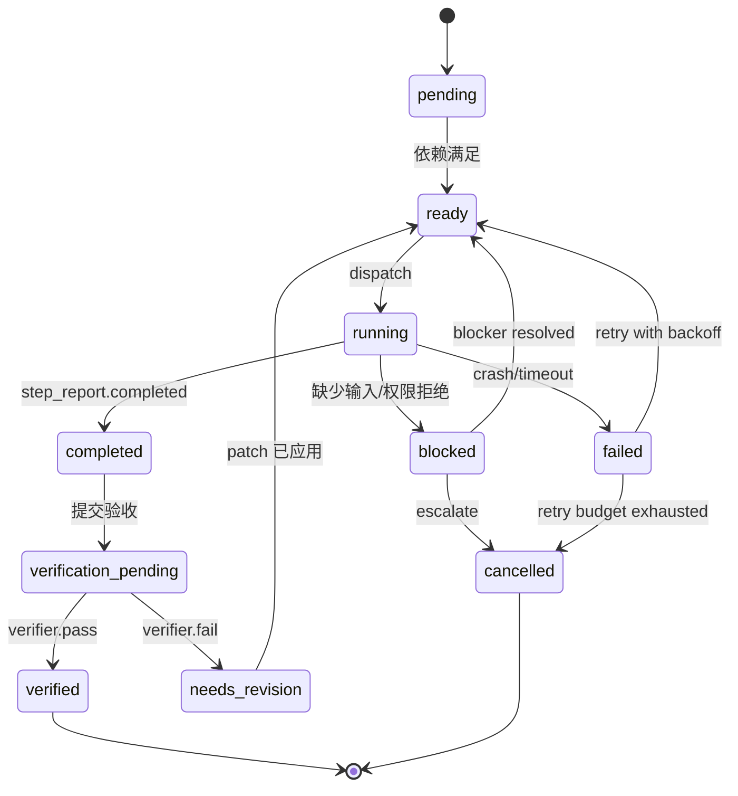
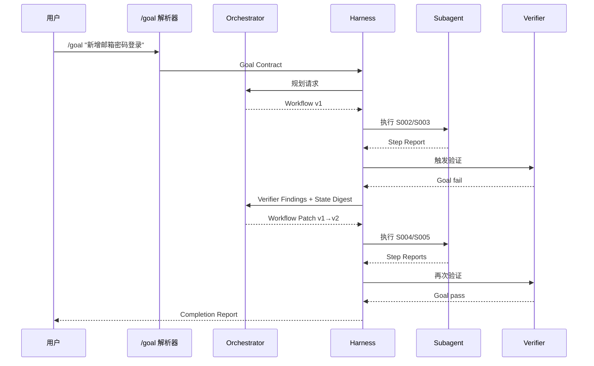

# 基于 Orchestrator、Harness、Subagents 与 Verifier 的动态 Workflow 框架说明文档

## 执行摘要

本文建议将该类系统定义为一种**“动态、可验证、可审计的 Workflow Runtime”**，而不是“多智能体群聊”。在这个定义下，**Orchestrator 只负责规划与改写工作流**，不直接写代码、不直接判定交付通过；**Harness 负责执行语义、状态机、权限和持久化**；**Subagents 负责在隔离上下文内完成局部任务**；**Verifier 负责分层验收**。这一分工与 OpenAI 对 harness 的描述高度一致：harness 是“核心 agent loop 与 execution logic”，而工程工作的杠杆点正在从“手写代码”转向“设计环境、明确意图、构建反馈回路”。citeturn16view1turn16view0turn21view5

与 Claude Code dynamic workflows 相比，本文推荐的框架**不让规划器输出任意可执行脚本，而是输出受约束的 Workflow IR 与 Workflow Patch**。Claude 的官方实现中，dynamic workflow 由 Claude 为任务生成 JavaScript 工作流脚本，运行时在后台执行，工作流的中间状态留在脚本变量中而不是主对话上下文中；它适合大规模审计、迁移与交叉核验研究，但其默认抽象更偏“脚本化编排”。本文建议把“脚本的灵活性”换成“结构化 IR 的审计性、回滚性和可多实现性”。citeturn5view0turn18view2turn20view3turn20view4

与 OpenAI Symphony 相比，本文建议的框架**借鉴其长期运行、单一权威状态、repo-owned policy、隔离工作区与 observability 的运行时纪律**，但将 Symphony 的“issue 级持续调度”进一步细化为“单 goal 内的 step 级动态编排”。Symphony 的公开规范强调：服务持续读取 issue tracker、为每个 issue 创建隔离 workspace、以 repo 中的 `WORKFLOW.md` 作为策略契约，并以有界并发、单一权威 orchestrator state 与明确的 retry/reconciliation 机制维持运行。本文则把这些运行时纪律与一个更强的三层 Verifier 管线结合起来。citeturn17view4turn5view3turn5view4turn6view4turn23view2

归纳起来，本文的核心建议有四条：其一，**/goal 先编译为 Goal Contract**，再交给 Orchestrator 生成 workflow；其二，**Subagent 只能提交结构化 Step Report，不能直接“指挥”下一步**；其三，**Verifier 至少拆为 Step、Integration、Goal 三层**；其四，**动态更新一律以 patch 形式提交并版本化**。这样做会牺牲一部分执行自由度，但能够显著提升可靠性、可观测性和工程可维护性。该取舍与 Claude 将“计划移入代码”以及 OpenAI 将“人类掌舵、智能体执行”作为工程纪律的方向相一致。citeturn20view0turn16view0turn21view4

## 设计基线与目标

从公开资料看，Claude Code dynamic workflows、OpenAI Symphony 与本文建议的框架，分别代表了三种不同的“谁持有计划、谁解释执行”的范式。Claude 的 workflow 是**Claude 生成、runtime 直接执行的脚本**；Symphony 是**长期运行服务依据 repo 契约与 issue 状态持续调度代理**；本文建议的框架则是**planner 生成结构化 IR，runtime 按 IR 解释执行并接受 verifier 反馈后重规划**。后者的目标不是复刻其中任一产品，而是把两者的强项做可实现的拼接：用 Claude 的动态规划能力，配合 Symphony 式运行时纪律与 OpenAI harness 强调的反馈回路。citeturn18view2turn17view6turn5view3turn16view0

下表是工程化比较结论。Claude 行主要依据 Anthropic 官方 workflow 与 subagent 文档；Symphony 行主要依据 OpenAI 官方文章与 `SPEC.md`；“本文建议”行是基于这些资料的综合设计。citeturn18view2turn5view2turn17view4turn5view3turn15view0

| 维度 | Claude Code dynamic workflows | OpenAI Symphony | 本文建议框架 |
|---|---|---|---|
| 计划持有者 | Claude 生成的 JS workflow 脚本 | 长期运行 orchestrator + repo `WORKFLOW.md` | Orchestrator 输出结构化 Workflow IR |
| 执行主体 | Workflow runtime + subagents | Orchestrator + per-issue workspace + coding agent | Harness + subagents + verifiers |
| 中间状态 | 主要在脚本变量 | orchestrator runtime state + workspace | Run state + Step Reports + Artifacts |
| 隔离边界 | workflow 与主对话隔离；subagent 独立上下文 | per-issue workspace | per-run / per-step worktree + agent sandbox |
| 验证模式 | 可在脚本中做交叉核验 | proof-of-work、CI、PR review 等 | Step / Integration / Goal 三层 verifier |
| 可复用性 | 可保存为命令并重跑 | `WORKFLOW.md` repo 契约 | versioned IR + Patch + `/goal` contract |
| 适合场景 | 大规模审计、迁移、研究 | 持续 issue 执行、always-on agent orchestration | 复杂软件交付、长任务迭代、有验收门的自治执行 |

这个框架的设计目标应当明确落在五个方面。第一，**规划与执行解耦**：planner 负责“决定做什么”，runtime 负责“保证怎么做”。第二，**上下文可控**：尽量让大输出停留在 subagent 本地上下文，只把摘要与证据回流。第三，**失败可定位**：失败不是一句自然语言抱怨，而是带对象、带准则、带证据的 verifier finding。第四，**状态可重建**：任何一个 run 都应能通过 workflow version、event log、step report 和 artifact 复原。第五，**权限可配置**：trusted 环境与高约束环境都能落地，只是策略不同。OpenAI 在 Symphony 规范中明确强调其 trust posture 是 implementation-defined，而 Anthropic 则在 subagent/workflow 文档中把工具、权限与并发边界写得很具体。citeturn5view3turn19view2turn20view4

一个关键取舍是：**Orchestrator 应输出结构化 IR，而不是任意脚本**。脚本方案的优势是表达力极强，与 Claude 的公开实现一致；但它会把“解释语义”也交给模型生成的程序，审计与回滚成本更高。结构化 IR 的优势是：更容易做 schema validation、diff、policy enforcement、approval gate 和 replay；代价是需要在 schema 中提前表达依赖、验收与更新语义。这一取舍更接近 Symphony 的“repo-owned 契约 + typed config + authoritative runtime state”的工程风格。citeturn5view3turn11view3turn23view2

另一个关键取舍是：**Subagent 不直接互相通信，默认只向 Orchestrator/Harness 回报**。Anthropic 官方文档明确区分了 subagents 与 agent teams：subagents 只回报给主 agent，而 direct messaging、shared task list 和更高协调开销属于 agent teams 模式。对一个以审计和 deterministic runtime 为目标的 harness 来说，默认禁止 subagent 互聊更稳健；确需协作时，再提升为“team”或“composite step”模式。citeturn22view1turn22view3

## 架构与执行流

建议的总体架构如下。它保留了 Symphony 式“runtime 拥有单一权威状态”的纪律，也吸收了 Claude 将“工作流从主对话中剥离、在后台运行”的好处。citeturn6view5turn20view4

```mermaid
flowchart TD
    U[用户] --> GC[/goal 解析器]
    GC --> G[Goal Contract]
    G --> O[Orchestrator]
    O --> W[Workflow IR vN]
    W --> H[Harness Runtime]

    H --> R[(Run State)]
    H --> A[(Artifact Store)]
    H --> E[(Event Log)]
    H --> WG[Worktree Manager]

    H --> S1[Subagent A]
    H --> S2[Subagent B]
    H --> S3[Subagent C]

    S1 --> SR1[Step Report]
    S2 --> SR2[Step Report]
    S3 --> SR3[Step Report]

    SR1 --> V1[Step Verifier]
    SR2 --> V1
    SR3 --> V1

    V1 --> V2[Integration Verifier]
    V2 --> V3[Goal Verifier]

    V1 --> H
    V2 --> H
    V3 --> H

    H -->|通过| DONE[Completion Report]
    H -->|失败或不完整| O
    O --> P[Workflow Patch]
    P --> H
```

在职责分配上，最重要的是**Harness 而非 Orchestrator 才是最终仲裁者**。OpenAI 对 harness 的公开阐述强调，harness 是核心 agent loop 和 execution logic；Symphony 规范则要求 orchestrator 持有单一权威运行时状态，并负责 dispatch、retry 与 reconciliation。基于这一基线，本文建议 Orchestrator 没有直接文件/命令权限，只能产生 `workflow_create` 或 `workflow_patch`；Harness 负责执行政策、日志、状态迁移与回滚。citeturn13view1turn11view3turn6view5

| 组件 | 主要职责 | 明确禁止 |
|---|---|---|
| `/goal` 解析器 | 把自然语言目标编译为 Goal Contract | 直接启动写代码 agent |
| Orchestrator | 生成 Workflow IR、补丁、重规划理由 | 直接写文件、运行 shell、裁定通过 |
| Harness | 解释执行 IR、管理状态机、权限、工作区、事件日志 | 将自然语言结果直接视为可信状态 |
| Subagent | 完成单 step 任务并输出 Step Report | 决定全局方向、越权调用受限工具 |
| Step Verifier | 核验单 step 是否满足 task 与 acceptance criteria | 修改工作流或重写实现 |
| Integration Verifier | 核验多个 step/patch 的组合正确性 | 替代测试执行层 |
| Goal Verifier | 核验最终交付是否满足 Goal Contract | 局部修修补补代替全局验收 |
| Artifact Store | 保存 patch、报告、测试结果、截图、日志摘要 | 充当隐式状态机 |

建议的关键设计决策与替代方案如下。表中“推荐”列是本文规范的选择。其利弊是综合 Claude/Symphony 官方资料与可实现性后得出的工程判断。citeturn20view0turn17view4turn23view2

| 决策点 | 方案 | 优点 | 缺点 | 推荐 |
|---|---|---|---|---|
| 工作流表达 | 任意脚本 | 表达力最强 | 审计、回滚、策略约束困难 | 仅作为高级模式 |
| 工作流表达 | 结构化 IR | 易校验、易 diff、易多实现 | 需要更完备 schema | **推荐** |
| 计划更新 | 全量重写 workflow | 实现简单 | 易丢状态、难审计 | 不推荐 |
| 计划更新 | Patch | 可追踪、可回滚 | Patch 设计更复杂 | **推荐** |
| Subagent 协作 | 直接互聊 | 灵活 | 协调开销高、状态难审计 | 默认不启用 |
| Subagent 协作 | 只回报主控 | 简洁稳定 | 需要更强规划器 | **推荐默认** |
| 验证结构 | 单 verifier | 实现成本低 | 容易 prompt 过载 | 仅 MVP 可接受 |
| 验证结构 | 三层 verifier | 可定位失败、可分工 | 设计更复杂 | **推荐** |

## 数据模型与 Schema

建议把所有**对外契约**都用 JSON Schema Draft 2020-12 发布，因为该版本是 JSON Schema 当前正式版本；而 workflow 更新则建议同时支持 RFC 6902 JSON Patch 与 RFC 7386 Merge Patch：前者适合对数组、步骤顺序与依赖图做精确操作，后者适合对元数据做简化覆盖。事件日志建议借鉴 OpenTelemetry Logs Data Model，至少保留 `Timestamp`、`SeverityText`、`EventName`、`Body` 和 `Attributes`。citeturn8view4turn8view5turn8view6turn9view1turn9view3turn9view4

### Goal Contract

| 字段 | 类型 | 含义 | 示例 | 约束 |
|---|---|---|---|---|
| `goal_id` | string | 目标唯一标识 | `goal_auth_001` | 全局唯一 |
| `goal_text` | string | 用户原始目标的规范化表达 | `为现有 Web 应用新增邮箱密码登录` | 必填，不可为空 |
| `success_definition` | array<string> | 可验证的成功条件列表 | `["登录失败显示错误","成功后跳转 dashboard"]` | 至少 1 条 |
| `non_goals` | array<string> | 明确不做的事情 | `["不重构支付模块"]` | 可空 |
| `constraints` | object | 技术、权限、预算、合规约束 | `{"no_new_dep":true}` | 键值需可机器解析 |
| `context_scope` | array<string> | 允许读取的目录/资源范围 | `["src/**","package.json"]` | 应与权限策略一致 |
| `approval_policy` | object | 高风险动作审批策略 | `{"before_install":true}` | 必须有默认值 |
| `budget` | object | token、时间、迭代预算 | `{"max_iterations":4}` | 上限必须显式化 |
| `created_at` | string | 创建时间 | `2026-06-01T09:00:00Z` | ISO 8601 |

### Workflow IR 与 Versioning

| 字段 | 类型 | 含义 | 示例 | 约束 |
|---|---|---|---|---|
| `workflow_id` | string | 工作流主键 | `wf_goal_auth_001` | 与 goal 绑定 |
| `goal_id` | string | 关联目标 | `goal_auth_001` | 必填 |
| `version` | integer | 当前版本号 | `1` | 从 1 递增 |
| `parent_version` | integer\|null | 父版本 | `null` / `1` | 首版为 null |
| `status` | enum | `draft/running/paused/completed/aborted` | `running` | 受 harness 控制 |
| `global_context` | object | 供 planner 共享的压缩上下文 | `{...}` | 只存摘要，不存大对象 |
| `steps` | array<Step> | step 列表 | `[...]` | 至少 1 条 |
| `control_policy` | object | 重试、回滚、并发、升级策略 | `{...}` | 必填 |
| `created_by` | string | 生成者 | `orchestrator@v1` | 可审计 |
| `created_at` | string | 创建时间 | `2026-06-01T09:02:00Z` | ISO 8601 |

### Run

| 字段 | 类型 | 含义 | 示例 | 约束 |
|---|---|---|---|---|
| `run_id` | string | 运行实例标识 | `run_20260601_001` | 全局唯一 |
| `workflow_id` | string | 来源 workflow | `wf_goal_auth_001` | 必填 |
| `workflow_version` | integer | 来源版本 | `1` | 必填 |
| `status` | enum | `queued/running/paused/failed/succeeded` | `running` | 受状态机控制 |
| `started_at` | string | 启动时间 | `2026-06-01T09:03:00Z` | ISO 8601 |
| `ended_at` | string\|null | 完成时间 | `null` | 结束时必填 |
| `active_step_ids` | array<string> | 当前执行中的 step | `["S002"]` | 与运行状态一致 |
| `worktree_map` | object | step 到 worktree 的映射 | `{"S002":".../wt_S002"}` | write 型 step 必有 |
| `metrics` | object | 运行指标 | `{"token_total":128000}` | 可增量更新 |
| `context_digest_version` | integer | 压缩上下文版本 | `3` | 重规划时递增 |

### Step

| 字段 | 类型 | 含义 | 示例 | 约束 |
|---|---|---|---|---|
| `step_id` | string | step 唯一标识 | `S002` | 在 workflow 内唯一 |
| `title` | string | 简短标题 | `实现登录表单与提交逻辑` | 必填 |
| `kind` | enum | `research/implement/test/review/verify/merge` | `implement` | 控制默认行为 |
| `agent_type` | string | 指向 Agent Registry | `code_writer` | 必须存在于 registry |
| `mode` | enum | `read_only/write_patch/test_only/review_only` | `write_patch` | 与权限一致 |
| `task` | string | 交付任务描述 | `在登录页实现表单...` | 必填，必须具体 |
| `inputs` | object | 文件、上游 step、显式数据 | `{...}` | 可机器解析 |
| `dependencies` | array<string> | 依赖 step | `["S001"]` | 不得成环 |
| `acceptance_criteria` | array<string> | 单 step 级验收条件 | `["不新增依赖","包含错误态"]` | 必填 |
| `goal_alignment` | object | 该 step 服务于哪些 goal 子句 | `{...}` | 新增 step 必填 |
| `retry_policy` | object | 最大重试次数、退避策略 | `{"max_attempts":2}` | 不得超全局上限 |
| `status` | enum | `pending/ready/running/...` | `ready` | 由 harness 驱动 |

### Step Report 与 Artifact

| 字段 | 类型 | 含义 | 示例 | 约束 |
|---|---|---|---|---|
| `report_id` | string | 报告 ID | `sr_S002_a1` | 唯一 |
| `step_id` | string | 所属 step | `S002` | 必填 |
| `attempt` | integer | 第几次尝试 | `1` | 从 1 开始 |
| `status` | enum | `completed/partial/failed/blocked` | `completed` | 必填 |
| `summary` | string | 高密度摘要 | `已完成登录页与提交逻辑` | 200–800 字建议 |
| `artifacts` | array<ArtifactRef> | 产物引用 | `[{...}]` | 不直接内嵌大文件 |
| `evidence` | array<object> | 对关键主张的证据 | `[{file,lines,claim}]` | 推荐必填 |
| `risks` | array<string> | 残余风险 | `["未覆盖路由守卫"]` | 可空 |
| `blocked_by` | array<string> | 阻塞原因码 | `["missing_api_contract"]` | blocked 时必填 |
| `suggested_next_steps` | array<object> | 仅建议，不具执行权 | `[{proposal,reason}]` | 可空 |
| `resource_usage` | object | token、耗时、命令数 | `{...}` | 用于 metric |
| `confidence` | number | 0–1 置信度 | `0.82` | 可空 |

| Artifact 字段 | 类型 | 含义 | 示例 | 约束 |
|---|---|---|---|---|
| `artifact_id` | string | 产物 ID | `art_patch_S002` | 唯一 |
| `type` | enum | `patch/test_report/screenshot/log_digest/doc` | `patch` | 必填 |
| `uri` | string | 存储位置 | `.harness/artifacts/S002.patch` | 推荐相对路径 |
| `hash` | string | 完整性校验 | `sha256:...` | 建议必填 |
| `mime_type` | string | MIME 类型 | `text/x-diff` | 可空 |
| `producer_step_id` | string | 生产者 step | `S002` | 必填 |
| `retention_policy` | enum | `ephemeral/run/workflow/permanent` | `workflow` | 默认 `run` |
| `created_at` | string | 时间 | `2026-06-01T09:07:00Z` | ISO 8601 |

### Workflow Patch

| 字段 | 类型 | 含义 | 示例 | 约束 |
|---|---|---|---|---|
| `patch_id` | string | patch 主键 | `patch_wf1_to_wf2` | 唯一 |
| `workflow_id` | string | 关联 workflow | `wf_goal_auth_001` | 必填 |
| `from_version` | integer | 原版本 | `1` | 必填 |
| `to_version` | integer | 目标版本 | `2` | 必填，必须递增 |
| `basis` | object | 产生 patch 的事实基础 | `{failed_steps:["S003"]}` | 必填 |
| `ops` | array<object> | patch 操作数组 | `[{op:"add_step",...}]` | 建议主格式 |
| `merge_overlay` | object\|null | 简单元数据覆盖层 | `{"control_policy":{...}}` | 可选 |
| `rationale` | string | 重规划理由 | `S003 未覆盖错误态` | 必填 |
| `predicted_impact` | object | 预计增加的成本与风险 | `{...}` | 可空 |
| `approved_by` | string\|null | 审批人 | `user` | 高风险时必填 |
| `applied_at` | string\|null | 应用时间 | `2026-06-01T09:11:00Z` | 应用后填充 |

### Agent Registry

| 字段 | 类型 | 含义 | 示例 | 约束 |
|---|---|---|---|---|
| `agent_type` | string | 逻辑类型名 | `repo_researcher` | 唯一 |
| `version` | string | 版本 | `1.2.0` | 语义化推荐 |
| `description` | string | 能力说明 | `只读分析代码库` | 必填 |
| `capabilities` | array<string> | 声明式能力 | `["read_files","search_code"]` | 必填 |
| `allowed_tools` | array<string> | 白名单工具 | `["Read","Grep","Glob"]` | 推荐显式设置 |
| `denied_tools` | array<string> | 黑名单工具 | `["Write","Edit"]` | 与白名单并存时以 deny 优先 |
| `input_schema_ref` | string | 输入 schema 引用 | `schemas/research-input.json` | 必填 |
| `output_schema_ref` | string | 输出 schema 引用 | `schemas/step-report.json` | 必填 |
| `permission_mode` | enum | `strict/interactive/plan_only` | `strict` | 必填 |
| `default_model` | string | 默认模型 | `gpt-5.3-codex` | 可实现自定义 |
| `max_parallelism` | integer | 最大并行实例数 | `8` | 防过载 |

一个可直接实现的 `Step` JSON Schema 片段如下。它采用 Draft 2020-12 风格，但只覆盖核心字段。citeturn8view4

```json
{
  "$schema": "https://json-schema.org/draft/2020-12/schema",
  "$id": "https://example.com/schemas/step.schema.json",
  "type": "object",
  "required": [
    "step_id",
    "title",
    "kind",
    "agent_type",
    "mode",
    "task",
    "dependencies",
    "acceptance_criteria",
    "status"
  ],
  "properties": {
    "step_id": { "type": "string", "pattern": "^S[0-9]{3}$" },
    "title": { "type": "string", "minLength": 3 },
    "kind": {
      "type": "string",
      "enum": ["research", "implement", "test", "review", "verify", "merge"]
    },
    "agent_type": { "type": "string" },
    "mode": {
      "type": "string",
      "enum": ["read_only", "write_patch", "test_only", "review_only"]
    },
    "task": { "type": "string", "minLength": 20 },
    "dependencies": {
      "type": "array",
      "items": { "type": "string" },
      "uniqueItems": true
    },
    "acceptance_criteria": {
      "type": "array",
      "items": { "type": "string" },
      "minItems": 1
    },
    "status": {
      "type": "string",
      "enum": [
        "pending",
        "ready",
        "running",
        "completed",
        "verification_pending",
        "verified",
        "needs_revision",
        "failed",
        "blocked",
        "cancelled",
        "skipped"
      ]
    }
  },
  "additionalProperties": false
}
```

## Orchestrator 与 Harness 运行时规范

### Orchestrator 行为规范

Orchestrator 的输入建议固定为六类：`goal_contract`、`workflow_state_summary`、`step_reports_digest`、`verifier_findings`、`agent_registry`、`runtime_policies`。之所以要这样做，是因为 Anthropic 的 subagent/workflow 设计已经证明，**把中间大输出留在子上下文或脚本变量里，只回主上下文摘要，会显著降低主控上下文污染**；同时 OpenAI 在 harness 与 Symphony 资料里反复强调“状态、执行逻辑、观测应由 runtime 持有”。citeturn19view5turn20view3turn13view1turn11view3

Orchestrator 的输出建议只允许三种形式：`workflow_create`、`workflow_patch`、`cannot_proceed`。其中 `cannot_proceed` 必须带结构化原因码，例如 `missing_requirement`、`budget_exceeded`、`unsafe_action`、`contradictory_constraints`。它**不得**直接输出代码、shell 命令、文件 diff 或“下一步请执行……”式自然语言。Harness 应对输出做 schema validation，不符合 contract 的结果直接丢弃并记为 planner failure。这个约束借鉴了 Symphony 对 typed config、strict template、single authoritative state 的规范取向。citeturn5view3turn5view6turn23view2

一个推荐的 Orchestrator System Prompt 摘要如下：

```text
You are the Workflow Orchestrator.

Your role is planning only.
You must never write code, propose shell commands, edit files, or decide that delivery is accepted.
You operate only on Goal Contract, Workflow State, Verifier Findings, and Agent Registry.

Output JSON only.
Allowed top-level types:
- workflow_create
- workflow_patch
- cannot_proceed

Rules:
- Every new step must map to at least one success_definition clause.
- Every step must declare dependencies, acceptance_criteria, and retry_policy.
- You may suggest adding agents only from the provided agent_registry.
- You must minimize plan drift: do not add work that cannot be tied to the goal contract.
- If verification failed, prefer patching the minimum set of steps.
- If constraints conflict or budget is exhausted, emit cannot_proceed with explicit reason_code.
```

该 prompt 的核心不是“让模型更聪明”，而是把它限制到**只生成可被 runtime 解释的意图结构**。这与 Claude 把 workflow“移入代码”以及 OpenAI 将工程重点转移到“环境、意图、反馈回路”的方向一致，但又比任意脚本更受约束。citeturn20view0turn16view0turn21view5

### Harness 运行时规范

Harness 的状态机建议如下。Symphony 明确要求有界并发、单一权威状态、reconciliation 与指数退避；Claude workflows 则表明中间状态应留在 runtime 内部，脚本本身不直接访问 filesystem/shell，而是协调 agents 去做。本文将这两类思想融合为一个更细粒度的 step 状态机。citeturn6view4turn20view4



在并行隔离上，建议**读型 step 可共享只读 workspace，写型 step 一律独占 worktree**。Git 官方文档说明，一个仓库可以附着多个 linked worktree；OpenAI 也公开强调其 Codex 体系通过 worktrees 与云端环境支持并行工作。因此，推荐的最小隔离单元不是“整个 run 只有一个目录”，而是“每个 write step 一个 worktree，每个 integration phase 一个 merge worktree”。citeturn3view9turn16view3turn21view4

建议的 worktree 规则如下：

| 类型 | 建议策略 | 理由 |
|---|---|---|
| `read_only` step | 可使用共享只读 checkout | 降低复制与同步成本 |
| `write_patch` step | 独立 worktree | 避免同文件并发污染 |
| `test_only` step | 复用对应 patch worktree 或集成 worktree | 保证测试对象一致 |
| `integration` phase | 单独临时 worktree | 做合并、冲突检查与最终验证 |
| 清理策略 | `verified` 后保留摘要与 patch；终态按 retention 清理 | 兼顾可审计与磁盘成本 |

上下文压缩建议采用“两级摘要”。一级是 step 结束时由 subagent 输出的 `summary + evidence + artifacts + risks`；二级是 Harness 周期性生成 `step_reports_digest`，只保留 goal 相关结论、可复用事实和未决 blocker。这样做的依据，一方面来自 Claude subagent 的“只回 summary、每个 subagent 从 fresh isolated context 起步”，另一方面来自 OpenAI 对“上下文是稀缺资源，给地图而不是 1000 页说明书”的公开经验。citeturn19view5turn19view1turn21view4

事件日志建议采用 JSONL 存储，并将字段映射到 OpenTelemetry 的日志数据模型。这样做的好处是：既可以简单落盘，又能后续接入 observability pipeline。最小字段建议如下。citeturn9view1turn9view3turn9view4

| 字段 | 对应 OTel 概念 | 示例 |
|---|---|---|
| `timestamp` | `Timestamp` | `2026-06-01T09:03:05.127Z` |
| `severity_text` | `SeverityText` | `INFO` |
| `event_name` | `EventName` | `step.dispatched` |
| `body` | `Body` | `Dispatch step S002 to code_writer` |
| `attributes` | `Attributes` | `{run_id, workflow_id, step_id, attempt}` |
| `trace_id` | `TraceId` | `wf_goal_auth_001` |
| `span_id` | `SpanId` | `S002-a1` |

如果需要 hooks，建议借鉴 Claude Hooks 的模式：**在生命周期点触发，向处理器传递 JSON context，并允许处理器返回决定**。适合的 hook 点包括 `before_dispatch`、`after_step_report`、`before_patch_apply`、`after_verification`、`before_cleanup`。需要强调的是，Symphony 把 workspace hooks 视为 trusted configuration，并要求为 hooks 设置 timeout；这在你的 harness 里也应保留。citeturn3view2turn4view5turn23view3

Orchestrator 与 Harness 的验收标准与指标，建议从第一天起量化：

| 模块 | 验收标准 | 可测指标 |
|---|---|---|
| Orchestrator | 输出始终 schema-valid；新增 step 总能映射到目标子句 | `schema_valid_rate`、`goal_alignment_coverage`、`avg_patch_size` |
| Harness | 无死锁；重启后可恢复 run；权限拒绝不导致状态损坏 | `stuck_run_rate`、`resume_success_rate`、`permission_denial_recovery_rate` |
| Context Compression | 重规划时不丢关键 blocker 与已验证事实 | `digest_recall_rate`、`avg_replan_context_tokens` |
| Worktree Manager | 并发 write step 不污染主分支 | `merge_conflict_rate`、`cleanup_success_rate` |

## Subagent、Registry 与 Verifier 规范

Subagent 规范应当更接近 Claude 的“受限 worker”，而不是“迷你 orchestrator”。Anthropic 官方文档指出，subagent 运行在自己的上下文窗口里，拥有独立 system prompt、特定工具访问和独立权限；它只返回摘要，而且**不能继续生成 subagents**。如果需要直接互相通信、共享任务列表与自协调，那是 agent teams 的范式，协调成本和 token 成本都更高。基于这个基线，本文建议 registry 中的普通 subagent 一律禁止嵌套 delegation。citeturn19view2turn19view1turn22view1turn22view3

建议的内置 agent types 如下：

| agent_type | 典型模式 | 典型工具 | 输出重点 |
|---|---|---|---|
| `repo_researcher` | `read_only` | `Read/Grep/Glob` | 路径、依赖、风险、集成点 |
| `code_writer` | `write_patch` | `Read/Edit/Write/Bash` | patch、变更摘要、残余风险 |
| `test_runner` | `test_only` | `Read/Bash` | 测试报告、失败栈、复现命令 |
| `code_reviewer` | `review_only` | `Read/Grep` | 问题清单、严重级别、建议 |
| `integration_agent` | `write_patch` | `Git/Bash/Read` | 合并结果、冲突、修复 patch |
| `doc_writer` | `write_patch` | `Read/Write` | 设计文档、迁移说明 |
| `security_reviewer` | `review_only` | `Read/Grep/dep scan` | 权限/注入/凭证相关问题 |

每个 agent_type 都应当在 Agent Registry 中声明输入输出 schema、allowed/denied tools、默认模型、max_parallelism 和 permission mode。Anthropic 的 subagent 文档已经给出非常接近的工程实践：frontmatter 定义 name、description、tools、hooks、MCP servers，且建议最小权限、版本控制和项目级复用。citeturn10view0turn10view2turn10view4

三层 Verifier 的设计建议如下。其思路可同时从 Claude 与 OpenAI 的公开实践中找到依据：Claude workflows 可以让独立 agents 对彼此发现做 adversarial review；OpenAI harness engineering 公开描述了“本地 review + 云端 review + 持续迭代直到 reviewer 满意”的循环；Symphony README 还提到 proof-of-work 可包括 CI 状态、PR review feedback、复杂度分析和 walkthrough 视频。citeturn20view0turn21view4turn15view0

| 层级 | 输入 | 判断对象 | 输出 | 失败后动作 |
|---|---|---|---|---|
| Step Verifier | step、step report、artifacts | 局部任务是否完成 | `pass/fail + finding` | 标记 `needs_revision` |
| Integration Verifier | 多 step 产物、集成 worktree、测试结果 | 组合后是否冲突、是否破坏系统 | `pass/fail + conflict map` | 产出修复建议或触发 patch |
| Goal Verifier | Goal Contract、已验证产物、体验证据 | 最终是否满足目标 | `pass/fail + unmet clauses` | 若失败则重规划或升级 |

建议的验收准则模板如下：

```text
验收对象：
- step_id / workflow_id / run_id

任务完成性：
- 是否完成 task 中所有显式要求
- 是否遵守 mode 与权限边界
- 是否产生约定 artifact

质量标准：
- 测试是否通过
- 是否有阻塞级 reviewer finding
- 是否满足 acceptance_criteria

目标对齐：
- 结果对应了哪些 success_definition 子句
- 仍未满足哪些子句

裁定：
- pass / fail / partial
- 失败原因码
- 证据
- 建议的最小修复面
```

失败处理上，建议坚持“**验证器只发现，不修复**”。验证器可以附带“最小修复面”建议，例如“需要补一条路由守卫测试”或“该 patch 改动跨越两个模块，应拆分”；但是否采纳由 Orchestrator 通过 patch 决定。这样可避免 verifier 自己一边发现问题、一边改掉问题，导致审计链断裂。

Subagent 与 Verifier 的指标可以设得非常工程化：

| 模块 | 建议指标 |
|---|---|
| Subagent | `task_success_rate`、`avg_runtime_sec`、`token_per_success`、`permission_denial_rate` |
| Step Verifier | `false_accept_rate`、`false_reject_rate`、`avg_verification_latency_ms` |
| Integration Verifier | `merge_conflict_detect_rate`、`regression_escape_rate` |
| Goal Verifier | `goal_clause_coverage`、`final_accept_rate`、`avg_iterations_to_goal` |

## 版本控制、/goal 与完整运行示例

在版本控制上，建议把**静态策略**与**动态计划**分层保存。静态策略可借鉴 Symphony 的 repo-owned `WORKFLOW.md` 契约思想；动态计划则保存为 `Goal Contract + Workflow IR vN + Patch 链`。Symphony 规范强调 `WORKFLOW.md` 应由仓库持有并版本控制，且变化可被 runtime 热重载；本文建议沿用这种“代码库内可追踪的 policy layer”，但把 `workflow.vN.json` 与 `patch.vN_to_vN+1.json` 作为 run-time layer。citeturn5view5turn23view1turn23view2

Patch 策略建议采用**混合式**：主格式用 RFC 6902 风格的 `ops[]` 表达增删改排；对少量元数据覆盖可接受 RFC 7386 风格 `merge_overlay`。原因很直接：step 列表、依赖和顺序本质上是数组/图结构，更适合 JSON Patch；而预算、阈值、显示元数据则适合 Merge Patch。citeturn8view5turn8view6

| 策略 | 优点 | 缺点 | 适用 |
|---|---|---|---|
| 全量重写 | 最简单 | diff 粗糙、难回滚 | 原型阶段 |
| RFC 6902 风格 op 数组 | 精确、可审计 | 手写复杂 | **步骤级 patch 推荐** |
| RFC 7386 merge | 简洁 | 数组替换语义弱 | **元数据覆盖推荐** |

`/goal` 的交互语义，建议借鉴 Claude 命令体系：命令出现在消息起始处，后随参数；在 SDK 模式下也应能以同样字符串触发。Anthropic 官方文档明确说明 slash commands 以 `/` 开头、只能在消息开头被识别，且后续文本作为参数。基于这个习惯，`/goal` 设计成“把自然语言目标编译成 Goal Contract 并启动 workflow session”是最自然的。citeturn3view5turn3view6

建议语法：

```bash
/goal "为现有 Web 应用新增邮箱密码登录" \
  --context "src/** package.json" \
  --success "登录失败显示错误;成功后跳转/dashboard;未登录访问/dashboard自动跳转/login" \
  --constraints "不新增后端服务;复用现有/api/session;不修改支付模块" \
  --mode supervised \
  --budget medium
```

下面给出一个完整但缩减过的链路示例，覆盖 `/goal → workflow v1 → run → step report → verification → patch → workflow v2`。示例中的字段可直接用于实现。

### Goal Contract 示例

```json
{
  "goal_id": "goal_auth_001",
  "goal_text": "为现有 Web 应用新增邮箱密码登录",
  "success_definition": [
    "登录页包含邮箱和密码表单",
    "登录失败时显示错误提示",
    "登录成功后跳转 /dashboard",
    "未登录访问 /dashboard 时自动跳转 /login"
  ],
  "non_goals": [
    "不重构支付模块",
    "不引入新的后端服务"
  ],
  "constraints": {
    "reuse_existing_api": "/api/session",
    "allow_new_dependency": false,
    "max_iterations": 3
  },
  "context_scope": ["src/**", "package.json"],
  "approval_policy": {
    "before_install_dependency": true,
    "before_merge_to_main": true
  },
  "budget": {
    "token_limit": 250000,
    "max_runtime_minutes": 45
  }
}
```

### Workflow v1 示例

```json
{
  "workflow_id": "wf_goal_auth_001",
  "goal_id": "goal_auth_001",
  "version": 1,
  "parent_version": null,
  "status": "running",
  "global_context": {
    "repo_summary": "Next.js app with existing /api/session endpoint and dashboard route",
    "known_risks": []
  },
  "control_policy": {
    "max_parallel_steps": 2,
    "replan_on_verification_fail": true,
    "max_patch_chain": 3
  },
  "steps": [
    {
      "step_id": "S001",
      "title": "分析现有认证入口与路由保护",
      "kind": "research",
      "agent_type": "repo_researcher",
      "mode": "read_only",
      "task": "识别登录页、/api/session、dashboard 路由保护与错误提示相关代码位置。",
      "inputs": {
        "files": ["src/**", "package.json"],
        "from_steps": []
      },
      "dependencies": [],
      "acceptance_criteria": [
        "输出相关文件清单",
        "指出可复用的 API 与路由守卫位置"
      ],
      "goal_alignment": {
        "success_clauses": [1, 2, 3, 4],
        "why_necessary": "明确改动边界与集成点"
      },
      "retry_policy": { "max_attempts": 1, "backoff_ms": 0 },
      "status": "verified"
    },
    {
      "step_id": "S002",
      "title": "实现登录表单与提交逻辑",
      "kind": "implement",
      "agent_type": "code_writer",
      "mode": "write_patch",
      "task": "在登录页增加邮箱和密码表单，提交到 /api/session，处理基本成功路径。",
      "inputs": {
        "files": ["src/app/login/**"],
        "from_steps": ["S001"]
      },
      "dependencies": ["S001"],
      "acceptance_criteria": [
        "表单可提交",
        "使用现有 /api/session",
        "不新增依赖"
      ],
      "goal_alignment": {
        "success_clauses": [1, 3],
        "why_necessary": "定义主交互路径"
      },
      "retry_policy": { "max_attempts": 2, "backoff_ms": 10000 },
      "status": "ready"
    },
    {
      "step_id": "S003",
      "title": "验证登录流程",
      "kind": "test",
      "agent_type": "test_runner",
      "mode": "test_only",
      "task": "运行与认证相关测试；若不存在覆盖，补充最小复现脚本但不修改产品代码。",
      "inputs": {
        "files": ["tests/**", "src/**"],
        "from_steps": ["S002"]
      },
      "dependencies": ["S002"],
      "acceptance_criteria": [
        "验证成功登录跳转",
        "验证失败登录提示",
        "验证受保护路由跳转"
      ],
      "goal_alignment": {
        "success_clauses": [2, 3, 4],
        "why_necessary": "提供交付证据"
      },
      "retry_policy": { "max_attempts": 2, "backoff_ms": 10000 },
      "status": "pending"
    }
  ]
}
```

### Run 与 Step Report 示例

```json
{
  "run_id": "run_20260601_001",
  "workflow_id": "wf_goal_auth_001",
  "workflow_version": 1,
  "status": "running",
  "active_step_ids": ["S002"],
  "worktree_map": {
    "S002": ".harness/worktrees/run_20260601_001/S002"
  },
  "metrics": {
    "token_total": 41820,
    "elapsed_seconds": 322
  },
  "context_digest_version": 1
}
```

```json
{
  "report_id": "sr_S003_a1",
  "step_id": "S003",
  "attempt": 1,
  "status": "completed",
  "summary": "登录表单可渲染并向 /api/session 提交；成功路径跳转通过，但失败提示未稳定显示，/dashboard 的未登录跳转未被产品代码显式保证。",
  "artifacts": [
    {
      "artifact_id": "art_test_report_S003",
      "type": "test_report",
      "uri": ".harness/runs/run_20260601_001/artifacts/S003/test-report.json",
      "hash": "sha256:8e0d...",
      "mime_type": "application/json",
      "producer_step_id": "S003",
      "retention_policy": "workflow",
      "created_at": "2026-06-01T09:10:26Z"
    }
  ],
  "evidence": [
    {
      "file": "src/app/login/page.tsx",
      "lines": [12, 66],
      "claim": "表单与提交逻辑已存在"
    },
    {
      "file": "src/middleware.ts",
      "lines": [1, 18],
      "claim": "未发现针对 /dashboard 的明确未登录跳转规则"
    }
  ],
  "risks": [
    "错误态 UI 未被断言覆盖",
    "受保护路由行为可能依赖隐式约定"
  ],
  "blocked_by": [],
  "suggested_next_steps": [
    {
      "proposal": "新增针对错误提示与 /dashboard 跳转的实现/测试步骤",
      "reason": "当前 Goal Contract 的子句 2 和 4 无法被验证为通过"
    }
  ],
  "resource_usage": {
    "token_total": 11340,
    "wall_clock_seconds": 71
  },
  "confidence": 0.77
}
```

### Verification Finding 与 Workflow Patch 示例

```json
{
  "verification_id": "vf_goal_001",
  "level": "goal",
  "target": "wf_goal_auth_001@v1",
  "result": "fail",
  "failed_clauses": [2, 4],
  "reason_code": "missing_error_state_and_route_guard",
  "summary": "成功登录路径满足，但失败提示与受保护路由跳转未达到 Goal Contract 的可验证标准。",
  "evidence_refs": [
    "art_test_report_S003"
  ],
  "minimal_fix_surface": [
    "补全错误提示逻辑或其测试证据",
    "为 /dashboard 增加明确路由保护并验证"
  ]
}
```

```json
{
  "patch_id": "patch_wf_goal_auth_001_v1_to_v2",
  "workflow_id": "wf_goal_auth_001",
  "from_version": 1,
  "to_version": 2,
  "basis": {
    "failed_steps": ["S003"],
    "failed_goal_clauses": [2, 4]
  },
  "ops": [
    {
      "op": "add_step",
      "after": "S002",
      "step": {
        "step_id": "S004",
        "title": "补全错误提示与受保护路由逻辑",
        "kind": "implement",
        "agent_type": "code_writer",
        "mode": "write_patch",
        "task": "确保登录失败时出现可见错误提示；为 /dashboard 增加明确未登录跳转逻辑。",
        "inputs": {
          "files": ["src/app/login/**", "src/middleware.ts", "src/app/dashboard/**"],
          "from_steps": ["S001", "S002", "S003"]
        },
        "dependencies": ["S002", "S003"],
        "acceptance_criteria": [
          "失败登录时页面出现错误提示",
          "未登录访问 /dashboard 跳转 /login"
        ],
        "goal_alignment": {
          "success_clauses": [2, 4],
          "why_necessary": "补齐未满足的 Goal Contract 子句"
        },
        "retry_policy": { "max_attempts": 2, "backoff_ms": 10000 },
        "status": "pending"
      }
    },
    {
      "op": "add_step",
      "after": "S004",
      "step": {
        "step_id": "S005",
        "title": "补充认证端到端回归测试",
        "kind": "test",
        "agent_type": "test_runner",
        "mode": "test_only",
        "task": "验证错误提示与 /dashboard 未登录跳转。",
        "inputs": {
          "files": ["tests/**", "src/**"],
          "from_steps": ["S004"]
        },
        "dependencies": ["S004"],
        "acceptance_criteria": [
          "子句 2 与 4 分别有通过证据"
        ],
        "goal_alignment": {
          "success_clauses": [2, 4],
          "why_necessary": "提供最终验收证据"
        },
        "retry_policy": { "max_attempts": 2, "backoff_ms": 10000 },
        "status": "pending"
      }
    },
    {
      "op": "replace",
      "path": "/steps/S003/status",
      "value": "verified"
    }
  ],
  "merge_overlay": {
    "control_policy": {
      "max_patch_chain": 3
    }
  },
  "rationale": "仅补齐未达成的 Goal Contract 子句，避免重做已通过的成功登录路径。",
  "predicted_impact": {
    "additional_tokens": 35000,
    "additional_runtime_minutes": 12
  }
}
```

### Workflow v2 摘要

```json
{
  "workflow_id": "wf_goal_auth_001",
  "version": 2,
  "parent_version": 1,
  "status": "running",
  "steps": ["S001", "S002", "S003", "S004", "S005"]
}
```

### Event Log 片段示例

```json
{"timestamp":"2026-06-01T09:00:02.001Z","severity_text":"INFO","event_name":"goal.created","body":"Goal contract compiled","attributes":{"goal_id":"goal_auth_001"}}
{"timestamp":"2026-06-01T09:02:10.412Z","severity_text":"INFO","event_name":"workflow.generated","body":"Workflow v1 created","attributes":{"workflow_id":"wf_goal_auth_001","version":1}}
{"timestamp":"2026-06-01T09:03:05.127Z","severity_text":"INFO","event_name":"step.dispatched","body":"Dispatch S002 to code_writer","attributes":{"run_id":"run_20260601_001","step_id":"S002","attempt":1}}
{"timestamp":"2026-06-01T09:10:27.603Z","severity_text":"WARN","event_name":"verification.failed","body":"Goal verifier failed clauses 2 and 4","attributes":{"workflow_id":"wf_goal_auth_001","version":1,"verification_id":"vf_goal_001"}}
{"timestamp":"2026-06-01T09:11:09.044Z","severity_text":"INFO","event_name":"workflow.patched","body":"Applied patch v1->v2","attributes":{"workflow_id":"wf_goal_auth_001","from_version":1,"to_version":2}}
{"timestamp":"2026-06-01T09:20:48.302Z","severity_text":"INFO","event_name":"goal.verified","body":"Goal contract satisfied","attributes":{"workflow_id":"wf_goal_auth_001","version":2,"run_id":"run_20260601_001"}}
```

下面的时序图对应上述 JSON 链路：



版本控制部分的验收标准与指标建议如下：

| 模块 | 验收标准 | 指标 |
|---|---|---|
| Patch Engine | patch 可回放、可逆、可审计 | `patch_apply_success_rate`、`rollback_success_rate` |
| Versioning | 任一版本都可从日志与 artifacts 复原 | `replay_success_rate` |
| `/goal` Compiler | 自然语言目标被稳定编译为可验证 contract | `goal_parse_success_rate`、`manual_edit_rate` |
| Iteration Policy | 不发生无穷 patch 链 | `avg_patch_chain_len`、`max_iterations_breach_rate` |

## 安全、API、测试与路线图

最主要的风险不是“agent 不够聪明”，而是**计划漂移、权限越界、上下文污染与无穷迭代**。OpenAI 在 Symphony README 中明确把项目标注为“trusted environments 下的 engineering preview”，规范里也把 trust posture 留给实现者；Claude 则通过独立权限、工具白名单和后台子任务 auto-deny 需要新审批的工具调用来限制子代理行为。因此，本文建议：默认最小权限、默认无直接 subagent 互聊、默认 patch 链有上限、默认高风险动作需审批。citeturn15view0turn5view3turn19view4

| 风险 | 表现 | 控制策略 |
|---|---|---|
| Plan drift | 一直修边角，不再贴近 goal | 每个新 step 强制声明 `goal_alignment` |
| 权限边界失控 | subagent 越权安装依赖/写无关目录 | Agent Registry 白名单 + Harness 拦截 |
| Context 窗口膨胀 | 重规划质量快速下降 | 两级 digest + artifact 引用不内嵌 |
| 无限迭代 | patch 链不断增长 | `max_patch_chain`、`max_attempts`、`cannot_proceed` |
| Hook 滥用 | 任意 shell 脚本挂死 runtime | 超时、截断日志、trusted-only 配置 |
| 并行冲突 | 多 patch 改同一位置 | 每写一步独立 worktree + integration verifier |

在 API 设计上，建议同时提供 REST、CLI 和 hooks。OpenAI 的 App Server 公开说明表明，**长期进程 + JSON-RPC 事件流 + 线程持久性**非常适合承载复杂 agent 生命周期；Claude Hooks 则证明了“生命周期点 + JSON context + 决策返回”是一个很实用的扩展面。因此，最稳妥的组合是：对外给工程系统 REST/CLI，对 IDE/富客户端保留事件流接口，对自动化扩展开放 hooks。citeturn16view1turn3view2turn4view5

建议的 REST/CLI 轮廓如下：

```text
POST   /api/goals
GET    /api/goals/{goal_id}
POST   /api/workflows/{workflow_id}/runs
GET    /api/runs/{run_id}
POST   /api/runs/{run_id}/pause
POST   /api/runs/{run_id}/resume
GET    /api/workflows/{workflow_id}/versions
POST   /api/workflows/{workflow_id}/patches
GET    /api/artifacts/{artifact_id}
GET    /api/events?run_id=...
```

```bash
harness goal create "新增邮箱密码登录" --context src/**
harness workflow show wf_goal_auth_001 --version 2
harness run watch run_20260601_001
harness patch apply patch_wf_goal_auth_001_v1_to_v2
harness verify goal wf_goal_auth_001 --run run_20260601_001
```

建议的目录结构如下。这里延续了 Symphony 的 repo-owned contract 思路，但把动态 workflow/version/run 拆得更显式。citeturn23view2turn15view0

```text
.harness/
  goals/
    goal_auth_001.json
  workflows/
    wf_goal_auth_001.v1.json
    wf_goal_auth_001.v2.json
  patches/
    wf_goal_auth_001.v1_to_v2.json
  runs/
    run_20260601_001/
      state.json
      context_digest.json
      step_reports/
      verifier_reports/
      artifacts/
      events.jsonl
      worktrees/
  registry/
    agents.json
    schemas/
  prompts/
    orchestrator.md
    verifiers/
  hooks/
    before_dispatch.d/
    after_verification.d/
```

测试策略建议一开始就覆盖三层：

| 层级 | 重点 | 示例 |
|---|---|---|
| 单元测试 | schema、patch apply、状态迁移、budget 计算 | Step schema 校验、patch 回放 |
| 集成测试 | worktree 管理、权限拦截、verifier 流 | 两个 write step 冲突检测 |
| 端到端测试 | `/goal → patch → completion` 闭环 | 登录功能示例从 v1 到 v2 |
| 回归测试 | digest 召回、plan drift、防无限迭代 | 重规划 5 次仍不偏离子句 |
| 故障注入 | agent crash、timeout、hook 卡死、日志失败 | 指数退避与状态恢复 |

建议关注的全局指标包括：`goal_completion_rate`、`avg_iterations_to_goal`、`avg_verification_time_sec`、`avg_tokens_per_successful_goal`、`stuck_run_rate`、`false_accept_rate`、`merge_conflict_rate`、`manual_intervention_rate`。这些指标能直接反映系统究竟是在“自动完成工作”，还是在“自动制造更多调度工作”。

MVP 路线图建议分三段走，而不是一开始追求“完全自治”：

| 里程碑 | 范围 | 完成标准 |
|---|---|---|
| MVP Alpha | `/goal`、Workflow IR v1、顺序执行、单层 verifier、JSONL 日志 | 能稳定跑通一条完整任务闭环 |
| MVP Beta | worktree 隔离、三层 verifier、patch/version、REST 只读 API | 能在失败后自动重规划并复跑 |
| Hardened Runtime | 权限策略、hooks、重启恢复、observability、审计回放 | 能在真实仓库中持续运行并可复盘 |

综合判断是：**最值得优先投入的，不是“再多加几个智能体类型”，而是“把 Workflow IR、Patch、Verifier 与 Runtime State 的契约定死”**。公开资料已经显示，Claude 的动态工作流、OpenAI 的 harness 与 Symphony 都在把“计划”“执行”“状态”“反馈回路”从单次聊天里移出来；真正的差异，不在于是否多智能体，而在于这些边界是否被工程化为可验证、可恢复、可审计的系统。citeturn18view2turn16view0turn17view6turn5view3